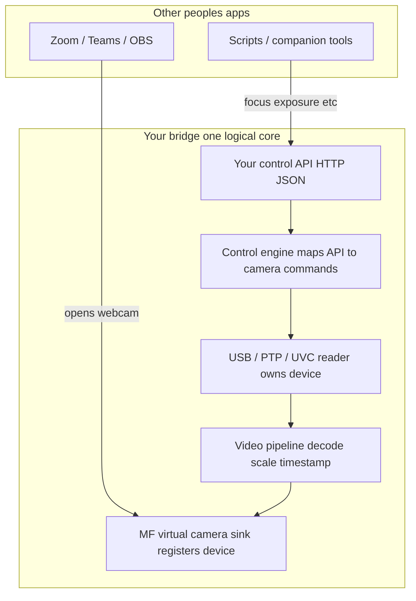
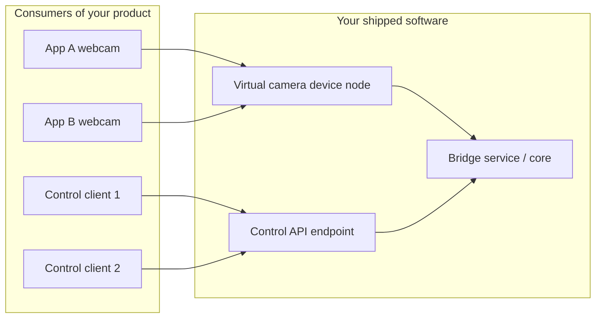
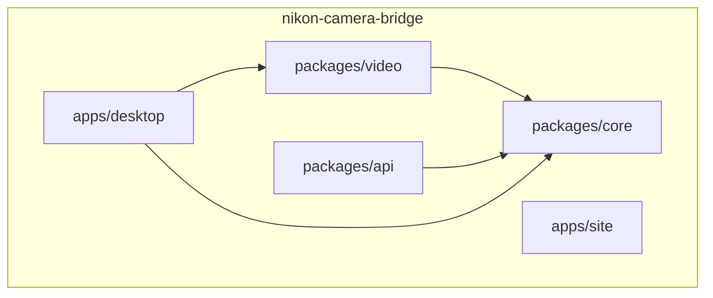
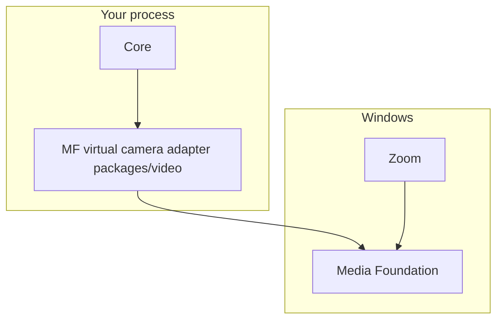

<a id="readme-top"></a>
<div align="center">
  <a href="https://github.com/AMDphreak/nikon-camera-bridge/graphs/contributors"></a>
  <a href="https://github.com/AMDphreak/nikon-camera-bridge/network/members"></a>
  <a href="https://github.com/AMDphreak/nikon-camera-bridge/stargazers"></a>
  <a href="https://github.com/AMDphreak/nikon-camera-bridge/issues"></a>
  <a href="https://github.com/AMDphreak/nikon-camera-bridge/blob/main/LICENSE"></a>

  <h1>Webcam Bridge for Nikon</h1>
  <p>Webcam Bridge for Nikon: use your Nikon USB webcam in Zoom, Teams, or OBS as a virtual camera, with HTTP control for focus and exposure. Windows first, open source.</p>
  <p>
    <a href="https://desktop-tooling.github.io/docs/nikon-camera-bridge/"><strong>Explore the docs »</strong></a>
    <br />
    <br />
    <a href="https://github.com/AMDphreak/nikon-camera-bridge/issues">Report Bug</a>
    &middot;
    <a href="https://github.com/AMDphreak/nikon-camera-bridge/issues">Request Feature</a>
  </p>
</div>

<details>
  <summary>Table of Contents</summary>
  <ol>
    <li><a href="#about-the-project">About The Project</a></li>
    <li><a href="#built-with">Built With</a></li>
    <li><a href="#repository-layout">Repository layout</a></li>
    <li><a href="#marketing-site-github-pages">Marketing site</a></li>
    <li><a href="#architecture--logical-layers-inside-the-eventual-service">Architecture</a></li>
    <li><a href="#getting-started">Getting Started</a></li>
    <li><a href="#usage">Usage</a></li>
    <li><a href="#contributing">Contributing</a></li>
    <li><a href="#license">License</a></li>
    <li><a href="#contact">Contact</a></li>
  </ol>
</details>

## About The Project

Windows-first **bridge** that will consolidate **Nikon USB webcam (UVC)** access with **PTP-style control** in one logical service, then **fan out video** through a **virtual camera** (Media Foundation) while exposing a **separate HTTP control API** for focus, exposure, and related commands.

This repository is a **pnpm workspace**: shared **core** types, a headless **HTTP API** package, a **video adapter** package (MF virtual camera, planned), an **Electron desktop** shell, and a **SolidStart** marketing site. Each workspace has its own `README` with a focused diagram where it helps; this file ties the story together.

<p align="right">(<a href="#readme-top">back to top</a>)</p>

## Built With

* **Desktop** — [![Electron][Electron.com]][Electron-url]
  * [![TypeScript][TypeScript.com]][TypeScript-url]
* **Marketing site** — [![SolidStart][SolidStart.dev]][SolidStart-url]
* **Monorepo** — [![pnpm][pnpm.io]][pnpm-url]
* **Video (planned)** — Media Foundation virtual camera adapter

<p align="right">(<a href="#readme-top">back to top</a>)</p>

## Repository layout

| Path | Role |
|------|------|
| [packages/core](./packages/core/README.md) | Types and small state helpers (no Electron, no MF). |
| [packages/api](./packages/api/README.md) | HTTP JSON control surface (`/health`, stub `/v1/command`, …). |
| [packages/video](./packages/video/README.md) | MF virtual camera registration and frame pump (planned). |
| [apps/desktop](./apps/desktop/README.md) | Electron UI and IPC stubs for local control. |
| [apps/site](./apps/site/README.md) | SolidStart static site; published to **GitHub Pages** (see below). |

## Marketing site (GitHub Pages)

The [`apps/site`](./apps/site) app builds to **static HTML** (prerendered `/` and `/about`). In **Settings → Pages**, set **Build and deployment** source to **GitHub Actions**. Pushes to `main` that touch `apps/site/**`, the Pages workflow, or the root lockfile run [`.github/workflows/pages.yml`](./.github/workflows/pages.yml) and publish to:

`https://AMDphreak.github.io/nikon-camera-bridge/`

Production-style preview (matches the Pages base path):

```powershell
$env:VITE_BASE_PATH="/nikon-camera-bridge/"
pnpm run build:site
pnpm dlx serve apps/site/.output/public
```

Local dev (Vite base `/`):

```powershell
pnpm run dev:site
```

## Architecture — logical layers (inside the eventual service)

One **core** owns USB and coordinates **two outward adapters**: video into MF, control into your HTTP API. Media Foundation is the **Microsoft library** you use to **implement** the virtual camera; it is not a replacement for your own control API.



## Who consumes what?



## Monorepo packages (build-time view)



## Media Foundation (MF) placement

MF is a **Windows user-mode API** used to register and feed a **virtual camera**. Consuming apps talk to Windows; your process registers the device and pushes frames. Your **control API** does not need to go through MF.



<p align="right">(<a href="#readme-top">back to top</a>)</p>

## Getting Started

Requirements: **Node 20+**, **pnpm 9+**.

```powershell
pnpm install
pnpm dev
```

`prepare` runs `pnpm run build:packages` after `pnpm install` so every library has a `dist/` output before the desktop typecheck or build. The desktop package sets `build.electronVersion` so **electron-builder** can resolve Electron under pnpm's hoisted layout.

<p align="right">(<a href="#readme-top">back to top</a>)</p>

## Usage

**HTTP API** (stub server):

```powershell
pnpm run dev:api
```

**Typecheck entire workspace:**

```powershell
pnpm typecheck
```

**Production build** (all packages + Electron bundle):

```powershell
pnpm build
```

**Windows desktop** (x64 + arm64 **`.msi`**, **`.msix`**, and portable **`.zip`**; unsigned):

```powershell
pnpm run build:win
```

**Linux desktop** (x64 + arm64 **`.deb`**, **`.AppImage`**, and **`.flatpak`** bundle; requires Flatpak tooling for the Flatpak target):

```powershell
pnpm run build:linux
```

**macOS desktop** (x64 + arm64 **`.dmg`**, unsigned):

```powershell
pnpm run build:mac
```

**Pack npm tarballs** for the three libraries (written to `dist-pack/`). Locally:

```powershell
pnpm run pack:packages
```

On **GitHub Actions**, library `.tgz` files are produced on the **Windows** desktop matrix leg (`pnpm run pack:packages`) so packing matches local developer machines; the Ubuntu job still compiles all packages for Linux CI coverage.

Electron writes each OS/arch combination under `apps/desktop/release/<staging-folder>/` so **x64** and **arm64** builds never share the same `win-unpacked` tree (avoids file locks on Windows).

### CI and releases

- **CI** (`.github/workflows/ci.yml`): Ubuntu builds `packages/*` and the **static marketing site** (`pnpm run build:site` with the GitHub Pages base path). A **desktop matrix** on **Windows**, **Ubuntu**, and **macOS** typechecks the workspace, runs `pnpm build`, then packages **x64 + arm64** artifacts per OS (Windows **MSI + MSIX + zip**, Linux **deb + AppImage + flatpak**, macOS **DMG**). The Windows leg also runs **`pnpm run pack:packages`** and uploads **`bridge-windows`** (MSI, MSIX, zips, library `.tgz`). Linux and macOS legs upload **`bridge-linux`** and **`bridge-macos`**.
- **Pages** (`.github/workflows/pages.yml`): On pushes to `main`, builds `apps/site` and deploys the prerendered bundle to **GitHub Pages** (enable **Pages → GitHub Actions** in repo settings first).
- **Release** (`.github/workflows/release.yml`): On `v*` tags, merges all `bridge-*` artifacts, runs **`scripts/render-winget.mjs`** and **`scripts/render-homebrew-cask.mjs`**, and publishes everything under **`release-assets/**`** (binaries, WinGet YAML, Homebrew cask Ruby) to the GitHub Release.

### Changelog

See [CHANGELOG.md](./CHANGELOG.md).

<p align="right">(<a href="#readme-top">back to top</a>)</p>

## Contributing

Pull requests and issues are welcome. By contributing, you agree your contributions are under the same license (see [`CONTRIBUTING.md`](./CONTRIBUTING.md)).

### Top contributors

<a href="https://github.com/AMDphreak/nikon-camera-bridge/graphs/contributors">
  
</a>

For per-person profile links, prefer [all-contributors](https://allcontributors.org/).

<p align="right">(<a href="#readme-top">back to top</a>)</p>

## License

This project is licensed under the [**GNU Affero General Public License v3.0 or later**](https://www.gnu.org/licenses/agpl-3.0.html) (SPDX: **`AGPL-3.0-or-later`**). See [`LICENSE`](./LICENSE) for the full text.

**Why AGPL?** It is a **strong copyleft** license: if someone modifies this code and **distributes** it or **runs it as a networked service** for others, they generally must **offer their source under the same license**. That discourages proprietary "copycat" forks and scam repackagers who won't publish source, while still allowing **anyone to study, improve, and redistribute** the project and to **charge for binaries** as long as they comply with the license.

<p align="right">(<a href="#readme-top">back to top</a>)</p>

## Contact

Ryan Johnson — [@amdphreak](https://twitter.com/amdphreak)

Project Link: [https://github.com/AMDphreak/nikon-camera-bridge](https://github.com/AMDphreak/nikon-camera-bridge)

Site: [https://AMDphreak.github.io/nikon-camera-bridge/](https://AMDphreak.github.io/nikon-camera-bridge/)

<p align="right">(<a href="#readme-top">back to top</a>)</p>

<!-- MARKDOWN LINKS & IMAGES -->
[Electron.com]: https://img.shields.io/badge/Electron-191970?style=for-the-badge&logo=Electron&logoColor=white
[Electron-url]: https://www.electronjs.org/
[TypeScript.com]: https://img.shields.io/badge/TypeScript-007ACC?style=for-the-badge&logo=typescript&logoColor=white
[TypeScript-url]: https://www.typescriptlang.org/
[SolidStart.dev]: https://img.shields.io/badge/SolidStart-2C4F7C?style=for-the-badge&logo=solid&logoColor=white
[SolidStart-url]: https://start.solidjs.com/
[pnpm.io]: https://img.shields.io/badge/pnpm-F69220?style=for-the-badge&logo=pnpm&logoColor=white
[pnpm-url]: https://pnpm.io/
