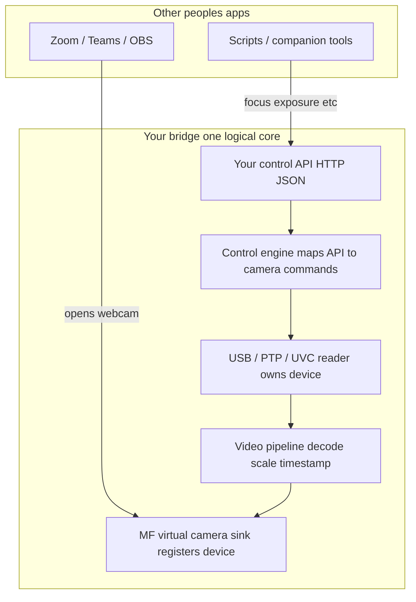
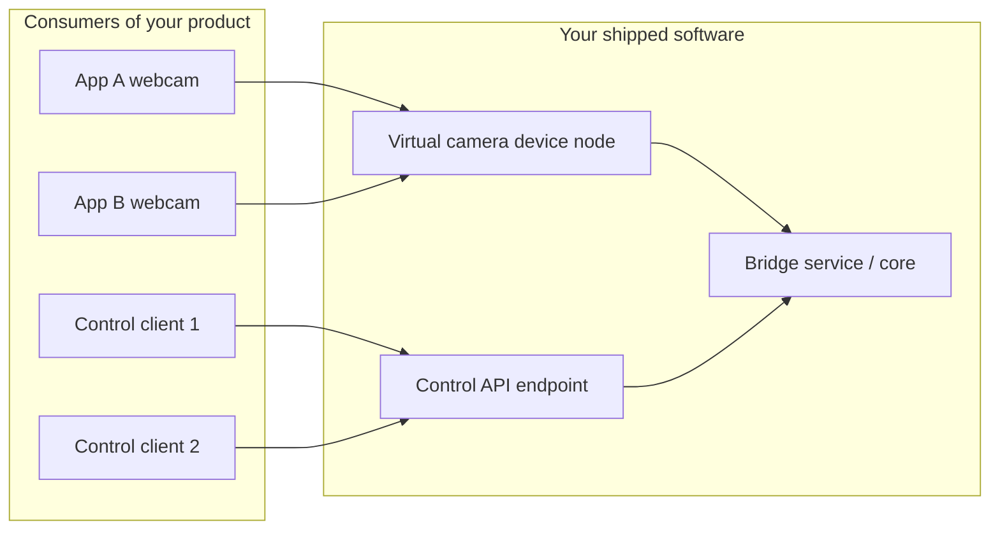
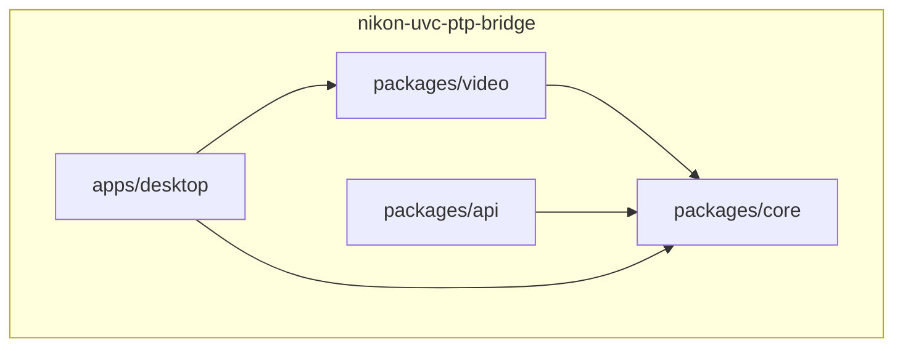
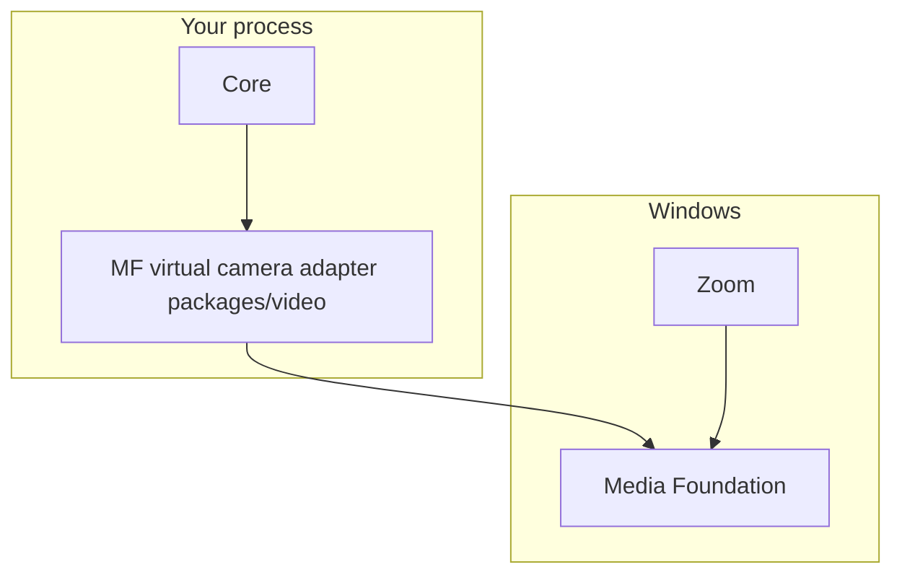

# Nikon UVC-PTP Bridge (monorepo)

Windows-first **bridge** that will consolidate **Nikon USB webcam (UVC)** access with **PTP-style control** in one logical service, then **fan out video** through a **virtual camera** (Media Foundation) while exposing a **separate HTTP control API** for focus, exposure, and related commands.

This repository is a **pnpm workspace**: shared **core** types, a headless **HTTP API** package, a **video adapter** package (MF virtual camera, planned), and an **Electron desktop** shell. Each workspace has its own `README` with a focused diagram; this file ties the story together.

## Repository layout

| Path | Role |
|------|------|
| [packages/core](./packages/core/README.md) | Types and small state helpers (no Electron, no MF). |
| [packages/api](./packages/api/README.md) | HTTP JSON control surface (`/health`, stub `/v1/command`, …). |
| [packages/video](./packages/video/README.md) | MF virtual camera registration and frame pump (planned). |
| [apps/desktop](./apps/desktop/README.md) | Electron UI and IPC stubs for local control. |

## Architecture — logical layers (inside the eventual service)

One **core** owns USB and coordinates **two outward adapters**: video into MF, control into your HTTP API. Media Foundation is the **Microsoft library** you use to **implement** the virtual camera; it is not a replacement for your own control API.



## Who consumes what?



## Monorepo packages (build-time view)



## Media Foundation (MF) placement

MF is a **Windows user-mode API** used to register and feed a **virtual camera**. Consuming apps talk to Windows; your process registers the device and pushes frames. Your **control API** does not need to go through MF.



## Development

Requirements: **Node 20+**, **pnpm 9+**.

```powershell
pnpm install
pnpm dev
```

`prepare` runs `pnpm run build:packages` after `pnpm install` so every library has a `dist/` output before the desktop typecheck or build. The desktop package sets `build.electronVersion` so **electron-builder** can resolve Electron under pnpm’s hoisted layout.

**HTTP API** (stub server):

```powershell
pnpm run dev:api
```

**Typecheck entire workspace:**

```powershell
pnpm typecheck
```

**Production build** (all packages + Electron bundle):

```powershell
pnpm build
```

**Windows desktop zip** (unsigned):

```powershell
pnpm run build:win
```

**Pack npm tarballs** for the three libraries (written to `dist-pack/`):

```powershell
pnpm run pack:packages
```

## CI and releases

- **CI** (`.github/workflows/ci.yml`): Ubuntu job builds and typechecks all `packages/*`, packs `.tgz` artifacts; Windows job typechecks the full workspace, runs `pnpm build` and `pnpm run build:win`, uploads the desktop zip from `apps/desktop/release/`.
- **Release** (`.github/workflows/release.yml`): On `v*` tags, repeats those builds and attaches **all** `.tgz` files plus the **Windows zip** to the GitHub Release.

## Changelog

See [CHANGELOG.md](./CHANGELOG.md).

## License

MIT
