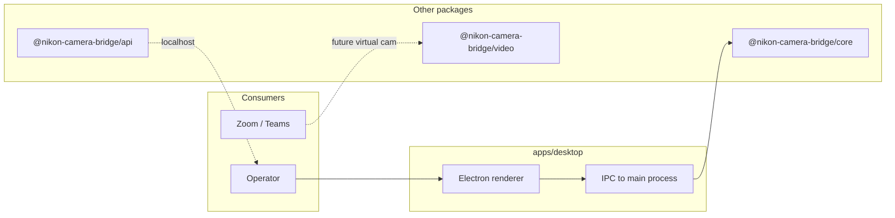

# @nikon-camera-bridge/desktop

Electron **shell** for the Nikon bridge: local IPC toggles (stubs), status text, and links to the workspace architecture. It imports shared types from `@nikon-camera-bridge/core` and stage metadata from `@nikon-camera-bridge/video` so the desktop stays aligned with the other packages.

## How it fits with the other pieces



The GUI is **one control client** among many; the long-term split is a headless core plus this app as an optional front-end.

## Scripts

```powershell
pnpm --filter @nikon-camera-bridge/desktop dev
pnpm --filter @nikon-camera-bridge/desktop run build
pnpm --filter @nikon-camera-bridge/desktop run build:win
```

From the **repository root**, `pnpm dev` and `pnpm run build:win` delegate here.

## See also

- [Repository root README](../../README.md) — full architecture diagrams.
