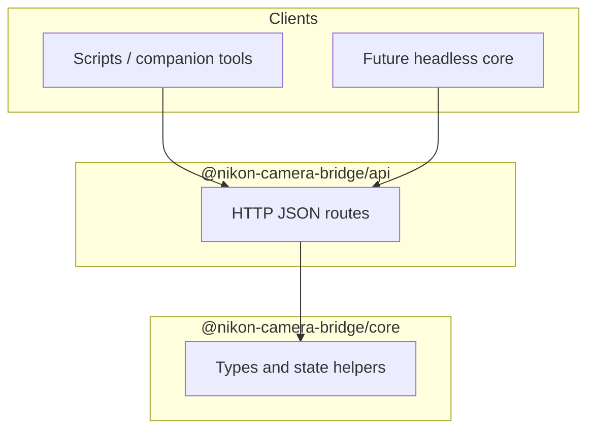

# @nikon-camera-bridge/api

**Control plane (HTTP).** Exposes a small JSON API on `127.0.0.1` for health checks and future **PTP-style commands** (focus, exposure, and so on). Consumer apps and automation talk here; they do **not** send those commands through the virtual webcam path.

Zoom/Teams stay dumb clients of the **video** adapter (`@nikon-camera-bridge/video`); anything that needs Nikon semantics should call **this API** (or IPC that wraps it).

## Diagram



## Run locally

After `pnpm install` at the repo root:

```powershell
pnpm run build
pnpm run start:api
```

Override port:

```powershell
$env:NIKON_BRIDGE_API_PORT = "39999"; pnpm run start:api
```

### Stub endpoints

| Method | Path | Notes |
|--------|------|--------|
| `GET` | `/health` | Liveness JSON |
| `GET` | `/v1/state` | Demo mirror of `BridgeState` |
| `POST` | `/v1/command` | Returns `501` until PTP mapping exists |
| `POST` | `/v1/state/mirror` | Dev-only: merge JSON into in-memory state |

## Build

```powershell
pnpm --filter @nikon-camera-bridge/api run build
```

See the [repository root README](../../README.md) for the full architecture.
