# @nikon-camera-bridge/core

Shared **types** and small **pure helpers** (initial bridge state, copy‑safe defaults) used by the desktop shell and—later—by the headless service when USB and virtual camera code move out of the GUI process.

This package deliberately stays **free of Electron, MF, and HTTP** so it can be imported anywhere in the workspace without dragging UI or OS media stacks.

## Relationship to the other pieces



## Build

```powershell
pnpm --filter @nikon-camera-bridge/core run build
```

See the [repository root README](../../README.md) for the full architecture.
