# @nikon-camera-bridge/video

**Video plane (virtual webcam).** This package will host the **Media Foundation** (and any native glue) that registers a **virtual camera** device so Teams, Zoom, and OBS see a normal Windows camera while the **bridge core** supplies frames.

Today it only exports **constants** so the workspace has a clear seam; the implementation will land here rather than inside the Electron renderer.

## Diagram



## Build

```powershell
pnpm --filter @nikon-camera-bridge/video run build
```

See the [repository root README](../../README.md) for how this sits beside `@nikon-camera-bridge/api`.
